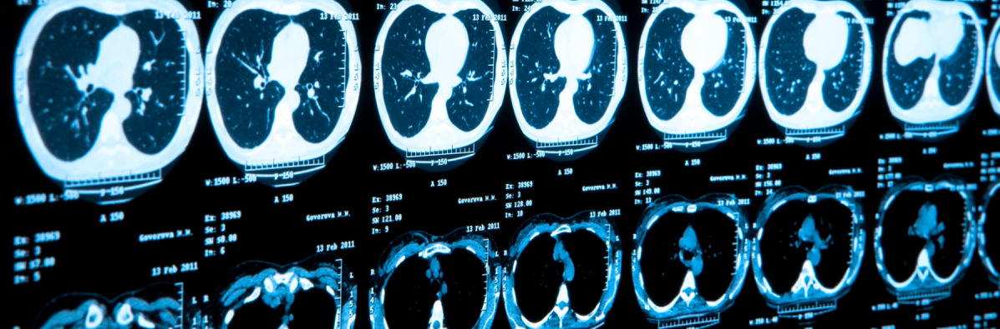

# Deep Learning for Improved Bronchial Tree Segmentation in CT Images

### Master's research project at UNSW CSE, 2020
This project focuses on application of deep learning based approaches, particularly recurrent neural
networks (RNN), in the problem of peripheral bronchial identification and tracking on computed
tomography (CT) of human’s chest. Potential of RNN for distal airway tracking has been explored
and compared with conventional methods such as B-spline interpolation in three dimensional
space. General framework and algorithm for airway localisation and tracing using combination of
convolutional neural network (CNN) and RNN or B-spline interpolation are given.
The work is primarily based on the results obtained by professor Daniel Moses at University of
New South Wales in his PhD dissertation "Computerised analysis of the bronchovascular anatomy
of the lung on multidetector CT studies" (2018) and uses that work as the baseline method for
research and improvements outlined in the current project.
Limitations of the proposed approach, such as inconsistency in sampling technique of crosssectional
images, imposed by the baseline method and data it generated, are explored and recommendations
for improvements and future research are proposed.

**Slides**: documentation/COMP9993 20T3 Seminar Oleg Kufirin.pdf  
**Report**: documentation/Deep_Learning_for_Improved_Bronchial_Tree_Segmentation_in_CT_Images___Project_report.pdf  

*main.py* - driver program  
*bronchial_tree.py* - implementation  
*annotations.txt* - manual annotations created with implemented annotation tool

### Implementational aspects
All the work in thiImplementational aspectss project has been done on a local computer with the following characteristics:
Intel Core i7-6500U CPU @ 2.5GHz, 8 GB RAM, GPU NVIDIA GeForce 920MX 2GB.
The code was written in Python 3.7.7 in Spyder IDE v.4.1.4 with the help of the following libraries:
scipy v.1.5.0, sklearn v.0.23.1, sortedcontainers v.2.2.2, numpy v.1.19.1, matplotlib v.3.2.2,
cv2 v.4.3.0 and other. For the deep learning part of the project Pytorch v.1.6.0 framework was
used utilising GPU resources.
